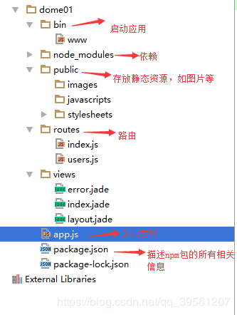

# node 

## express项目新建 
> 操作步骤如下：
1. npm install express -g //全局安装express
2. npm install express-generator -g //全局安装express生成器
3. express projiectName //初始化项目
4. npm install //安装依赖



_在express生成器初始化后：视图引擎设置是jade模板，想设置ejs和html_

```
    //在目录的app.js文件中修改
    //删除支持xx.jade
    app.set('view engine','jade');//删除
    //添加支持xx.html页面的语句
    npm install ejs --save 
    var ejs = require('ejs');
    app.engine('html',ejs.__express);
    app.set('view engine','html');
    //若想支持xx.ejs,则将html修改为 ejs 
    app.set('view engine','ejs');

    
```
