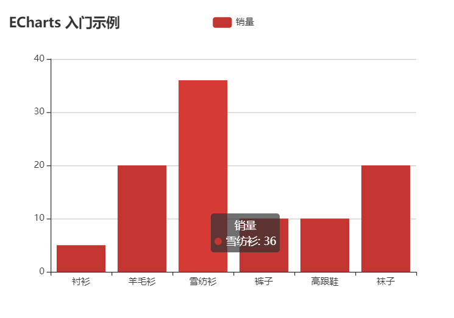
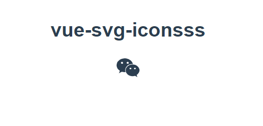
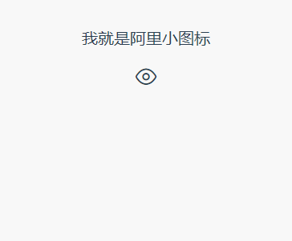
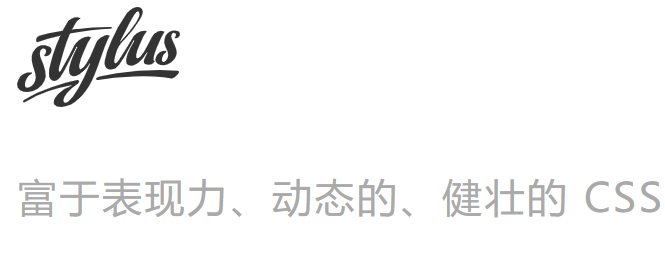
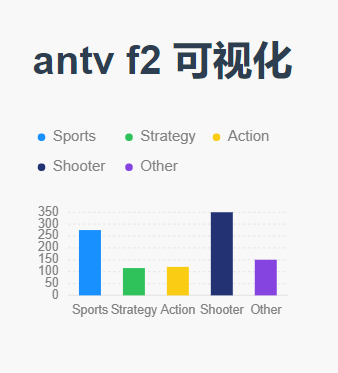

# vue各种开发点

1. 如何在 Vue 项目中使用 echarts



```
//方式一：使用echarts.js的方式
    //下载依赖包 
    npm install echarts -S
    //全局引入 mian.js 静态引入
    import echarts from 'echarts'
    //挂载到Vue对象的原型上
    Vue.prototype.$echarts = echarts

    //在vue组件设置一个dom (div 指定宽高) 在methods:{//方法编写和在 mounted钩子函数执行绘画图表的方法}


//方式二： 使用vue-echarts组件的方式
    npm install vue-echarts --save
    //组件引入vue-echarts依赖文件 1: ECharts组件 2： bar
    import ECharts from "vue-echarts/components/ECharts";
    import "echarts/lib/chart/bar";

    //在template模板引入 v-echart组件
     <v-chart class="my-chart" :options="bar"></v-chart>
     //编写data(){return{//.....}}配置文件 详情查看 app.vue代码

```

2. 在Vue中使用SVG



```
    //使用vue-svg-icon 插件进行对svg的按需加载
    npm install vue-svg-icon --save 
    //在入口文件 引入和全局注册 
    import Icon from "vue-svg-icon/Icon.vue";
    Vue.component("icon",Icon);
    //在src目录下新建 svg文件夹 新建demo.svg

    <?xml version="1.0" standalone="no"?><!DOCTYPE svg PUBLIC "-//W3C//DTD SVG 1.1//EN" "http://www.w3.org/Graphics/SVG/1.1/DTD/svg11.dtd">
    <svg t="1502683891821" class="icon" style="" viewBox="0 0 1024 1024" version="1.1" xmlns="http://www.w3.org/2000/svg" p-id="2885" xmlns:xlink="http://www.w3.org/1999/xlink" width="16" height="16">
    <defs>
        <style type="text/css"></style>
    </defs>
        <path d="M282.6 363.8c-23.7 0-47-15.7-47-38.9 0-23.7 23.3-38.9 46.5-38.9 23.7 0 38.9 15.2 38.9 38.9 0.5 23.2-15.1 38.9-38.4 38.9zM500.4 286c23.7 0 38.9 15.2 38.9 38.9 0 23.3-15.2 38.9-38.9 38.9-23.3 0-47-15.7-47-38.9 0-23.7 23.7-38.9 47-38.9z m167.7 84.5c9.8 0 19.7 0.5 30 1.8-27.3-125.6-161.4-218.7-314.4-218.7C212.4 153.6 72 270.3 72 418.3c0 85.9 46.5 155.6 124.8 210.2l-31.3 93.9 109.1-54.6c38.9 7.6 70.2 15.7 109.1 15.7 9.4 0 19.2-0.5 29.1-1.3-6.3-20.6-9.8-42.9-9.8-65.3-0.1-136 116.6-246.4 265.1-246.4z" p-id="2886"></path>
        <path d="M772.7 573.9c-15.2 0-30.9-15.2-30.9-30.9 0.5-15.7 15.7-31.3 30.9-31.3 23.7 0 39.4 15.7 39.4 31.3-0.1 15.7-15.7 30.9-39.4 30.9z m-171.3 0c-15.2 0-30.9-15.2-30.9-30.9s15.7-31.3 30.9-31.3c23.7 0 38.9 15.7 38.9 31.3 0.5 15.7-15.2 30.9-38.9 30.9zM952 613.3C952 488.5 827.2 387 687.3 387c-148 0-264.7 101.5-264.7 226.3 0 124.8 116.7 225.8 264.7 225.8 31.3 0 62.6-8.1 93.5-15.7l85.9 47-23.7-77.8c62.5-47 109-109.1 109-179.3z" p-id="2887"></path>
    </svg>

    //详细代码组件 svg.vue

```
3. vue项目中使用阿里的Iconfont
> 先到: 阿里的Iconfont图库定制化图标项目下载，在项目中新建icon文件夹 和在assets新建styls.css文件，修改css文件中的文件路径，在组件中使用置标即可



```
   // 打开下载好的 alibaba图标文件中的 index.html 编写style.css
 @font-face {
    font-family: 'iconfont';
    src: url('./icon/iconfont.eot');
    src: url('./icon/iconfont.eot?#iefix') format('embedded-opentype'),
        url('./icon/iconfont.woff2') format('woff2'),
        url('./icon/iconfont.woff') format('woff'),
        url('./icon/iconfont.ttf') format('truetype'),
        url('./icon/iconfont.svg#iconfont') format('svg');
    }

    .iconfont {
        font-family: "iconfont" !important;
        font-size: 24px;
        font-style: normal;
        -webkit-font-smoothing: antialiased;
        -moz-osx-font-smoothing: grayscale;
    }

    //在vue项目入口文件静态引入 css mian.js
    import './style.css'
    //在组件中使用alibaba图标
    <i class="iconfont">&#xe633;</i>

    //Font-class方式 引入 main.js
    import './icon/iconfont.css';
    //在组件中使用
    <span class="iconfont icon-wokiy">wokiy self icon</span>
    
```

4. vue中使用stylus（css预处理）
> CSS 预处理，顾名思义，预先处理 CSS。那 stylus 咋预先处理呢？stylus 给 CSS 添加了可编程的特性，也就是说，在 stylus 中可以使用变量、函数、判断、循环一系列 CSS 没有的东西来编写样式文件，执行这一套骚操作之后，这个文件可编译成 CSS 文件。




```
    //安装
    npm install stylus stylus-loader --save
    
    //vue2.0之后，webpack不再进行配置，vue会自动检测到使用了stylus语法，会自动调用stylus-loader进行解析。开始在组件中编写stylus风格的代码
    
    <style scope lang="stylus">
        ......
    </style>

    // 具体stylus语法使用方法
    
```

5. vue移动端可视化方案 F2
> https://antv.alipay.com/zh-cn/f2/3.x/demo/index.html 官网地址。详细文档可以查新官网 antv美观的移动端可视化方案



```
    //安装依赖
    npm install @antv/f2 --save
    //安装好之后，可以使用静态引入和动态引入 import·require 在vue中的使用
    const F2 = require('@antv/f2/lib/index')
    //在模板中新建 canvas 并指定id
    <canvas id="mychart" width="400" height="400"></canvas>

    //创建 Chart 图表对象，指定图表 ID、指定图表的宽高、边距等信息；
    const chart = new F2.Chart({
        id:'myChart',
        pixelRatio: window.devicePixelRatio,//分辨率
    });
    //载入图表数据源； f2 对json数组 数组中的元素是每个对象[{}......]
    chart.source(data);
    //使用图形语法进行图表的绘制；
    chart.interval().position('genre*sold').color('genre');
    //渲染图表。    
    chart.render();
    
```
 
6. vue中封装axios整理

