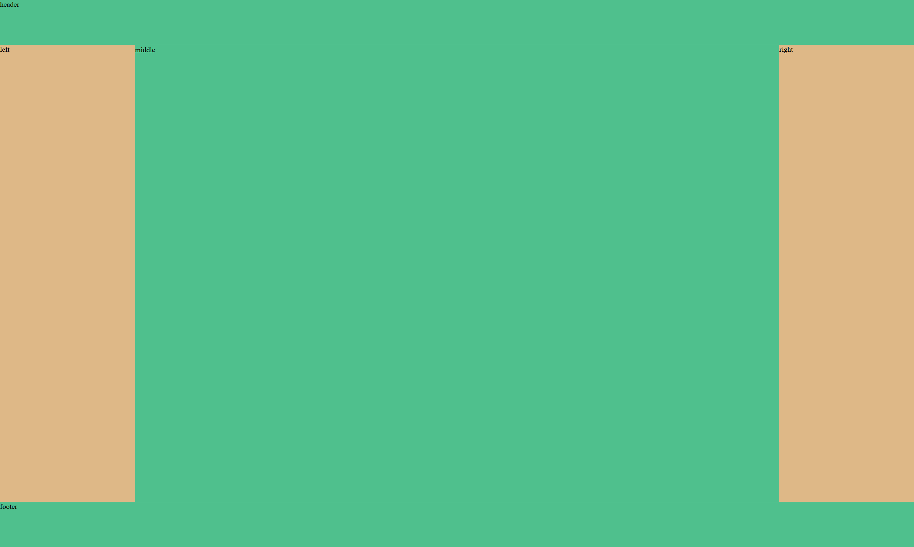

# 圣杯布局
1. header和footer占屏幕全部高度，高度固定
2. 中间的container部分是一个三栏布局
3. left 和right 宽度固定，middle自适应填满整个区域；高度三栏中最大高度

```
    //详细代码见 [浮动实现.html]
    {
        实现原理
        1: 设置顶部底部 header footer固定宽度：xx1px；宽度占100%；设置背景色 background-color:xxx;
        2: 内容.container块下的div全部设置 浮动float:left; 左右div块设置固定宽度，300px;设置.middle块宽度占100%。
        3: 让.left:-100%; .right":-300px;
        4: .container 设置padding:0 300px;向内部挤空间。
        5： 设置.container 相对定位。设置 left right 左右站住左右的空挡
        6：设置站点的最小宽度，拒绝拉伸国小变形: min-width:1000px;
        over
    }
```
- 浮动实现 | flex实现圣杯布局 | 栅格系统实现圣杯布局

